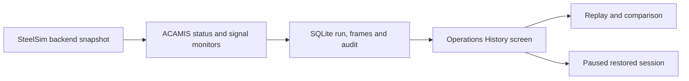

# Task 4: Operations History

Task 4 adds a local operational journal and a read-only history screen to SteelSim. Each simulation session receives a run ID. The backend records checkpoints, sampled simulation frames, incidents, recovery status, signal findings, and policy audit entries in SQLite.

The **Operations History** screen can replay recorded frames, plot plant power, compare summary values from two loaded runs, download a JSON incident report, and restore a saved run into a new paused simulation session.

## Data flow

The journal is the source for replay. Playback does not advance the live engine or execute procedures. Restoring requires an explicit click and leaves the restored session paused until the operator resumes it. Connected model keys and model replies are excluded from the archive.

## Additional signal evidence

ACAMIS compares measured simulated telemetry with the deterministic baseline for each running asset. Three consecutive running ticks are required before it flags:

| Signal | Rule |
| :--- | :--- |
| Thermal | Temperature differs from baseline by more than 40 °C. |
| Cooling | Water flow falls below 75% of baseline. |
| Electrical demand | Power draw rises above 112% of baseline. |

Concurrent flagged signals on one asset appear together as correlated evidence. They do not establish a root cause and do not schedule new automatic repairs. The existing rolling-throughput detector and its registered low-risk simulated recovery remain separate.

## Storage and deployment

Set `STEELSIM_HISTORY_DB` to the SQLite path. The default is the backend's local `data/operations.sqlite3`; Git ignores that directory. The current free Render service has no persistent disk configured, so hosted recordings may disappear after a restart, redeploy, or host replacement. Production use would require persistent storage, backups, retention limits, and access control.

The implementation writes frames synchronously. Very fast simulation clocks may slow down, and long runs can grow the database. A storage failure is surfaced in ACAMIS while the current simulation continues; recordings may have gaps. This is a single-process MVP journal, not a production historian.

## API

The history endpoints below use the same optional shared API-key middleware as the other SteelSim API routes:

| Method | Endpoint | Purpose |
| :--- | :--- | :--- |
| `GET` | `/api/history/runs?limit=100&offset=0` | Recent run summaries; `limit` is capped at 100. |
| `GET` | `/api/history/runs/{run_id}` | Run metadata and policy audit. |
| `GET` | `/api/history/runs/{run_id}/frames?after=0&limit=500` | Forward pagination through recorded frames; `limit` is capped at 500. |
| `GET` | `/api/history/runs/{run_id}/report` | Downloadable incident report data. |
| `POST` | `/api/history/runs/{run_id}/restore` | Create a paused simulation from the saved checkpoint. |

See the [investor demo](/getting-started/investor-demo) for a presentation flow.
